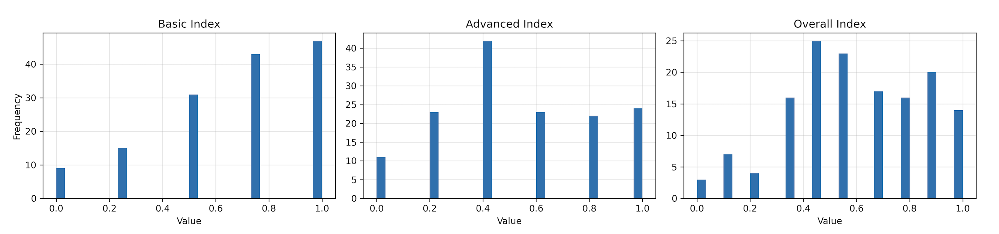
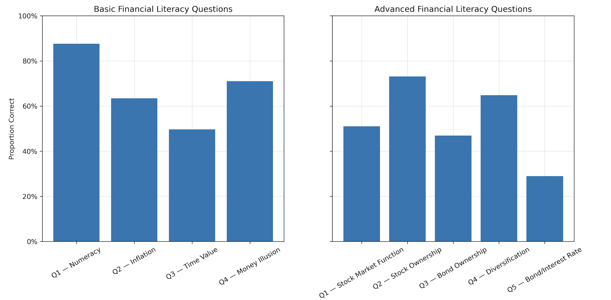
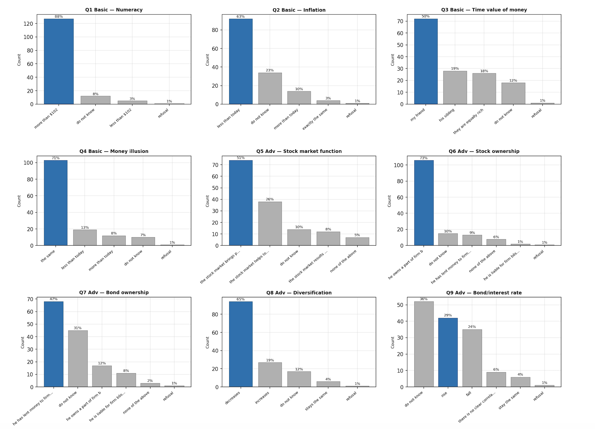
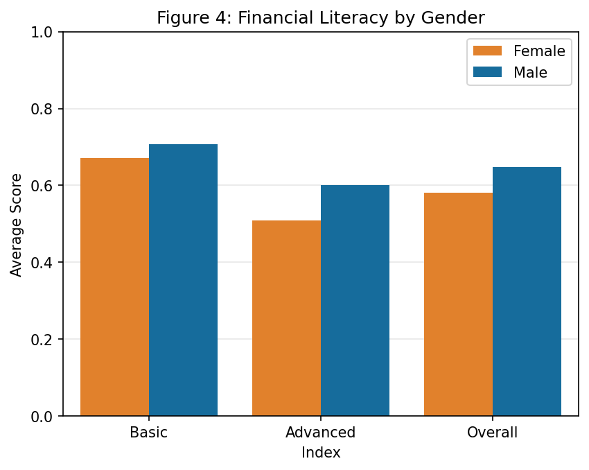
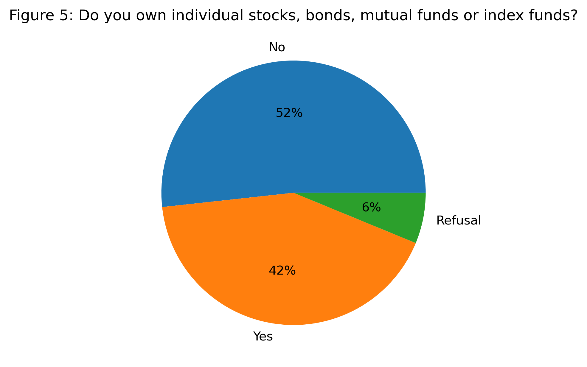
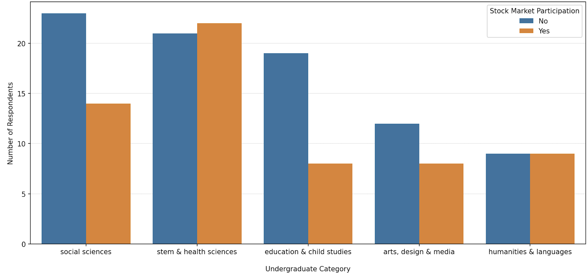
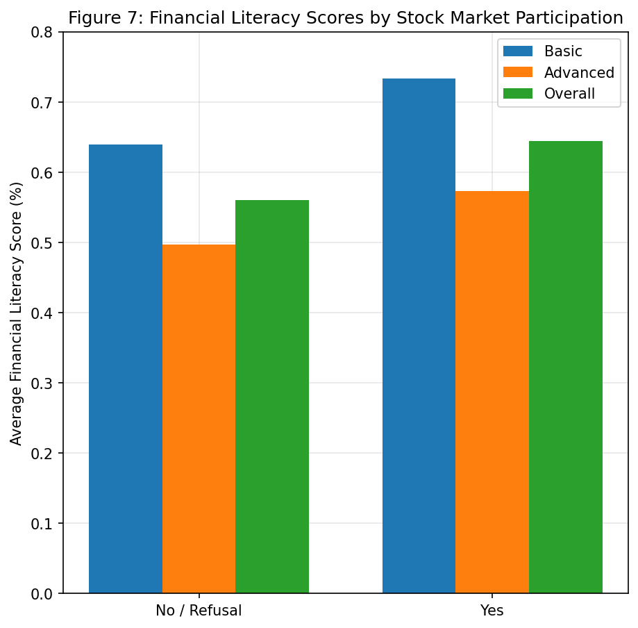
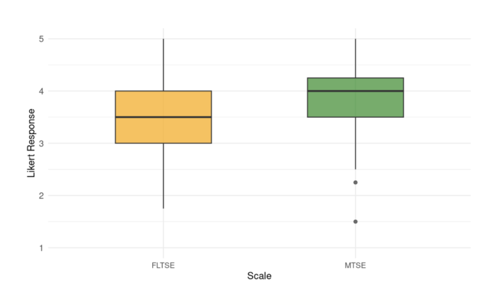

```{r}
#| include: false
#| warning: false
#| message: false

# Load packages
library(tidyverse)
library(knitr)
library(here)
```

# Introduction

Financial literacy is broadly defined as having the knowledge, skills and confidence to make responsible financial decisions [@nicolini2013; @oecd2017]. It is conceptualized by the OECD as dependent on an individuals’ financial knowledge, financial behaviours, and financial attitudes. Financial knowledge refers to the basic knowledge of financial concepts and the associated numeracy skills needed to apply their knowledge in financial contexts [@oecd2023]. It includes understanding financial concepts such as inflation, interests on loans, risk and return, the time value of money, risk diversification, and simple and compound interest. It also encompasses the numeracy skills needed to apply these skills, for instance, by computing simple and compound interest calculations. Financial behaviour refers to the behaviours and actions that affect an individual's financial situation and well-being in the short and the long term [@oecd2023]. Individuals with positive financial behaviours keep track of their expenses and personal finances, plan for saving and investing in the short and long term, and make decisions relating to financial products and services by considering multiple options. Last, financial attitudes refers to the extent that attitudes towards money influences financial decisions and behaviours. It is a recognition that even if the individual has the knowledge and ability, this might not align with their actions due to their attitudes.

Existing studies have shown that financial illiteracy is widespread, with many individuals lacking even basic economic knowledge [@lusardi2007; @lusardi2011]. In 2022, thirty-nine countries assessed their citizens’ financial literacy levels through the OECD/INFE Toolkit for Measuring Financial Literacy and Financial Inclusion. They found that the average financial literacy score among all participants was 60%, with only 34% of adults reaching the target financial literacy score of 70%. In the Canadian context, cross-country studies have placed Canada above other OECD countries like the U.K. and the U.S. in terms of financial literacy [@nicolini2013]. However, a study measuring financial literacy found that only 42% of Canadians answered basic questions on interest rates, inflation, and risk diversification correctly [@boisclair2014].

The math educational community has increasingly recognized the importance of teaching financial literacy to students from an early age [@oecd2005; @compen2019; @lusardi2019] with several countries, including the U.K., Spain, Ireland, Denmark, Belgium, the Czech Republic, and Estonia, responding with initiatives to teach financial literacy to their citizens through mandatory financial literacy curricula in schools [@compen2019]. By teaching students about healthy spending, effective saving strategies, retirement-planning, and beyond, the integration of personal finance education is hypothesized to be a proactive tool to support individuals in managing their finances. In Ontario, personal finance is taught in some high school mathematics courses in Grades 11 and 12, particularly those in the college and workplace streams. However, given citizens' changing economic realities, the Ministry of Education has expanded educational initiatives to enhance financial literacy education by introducing a financial literacy strand to their K-8 Mathematics Curriculum (2020) and the Grade 9 Mathematics Curriculum (2021), a strand designed to equip students with the skills and knowledge to “manage their personal financial well-being with confidence, competence, a critical and compassionate awareness of the world around them” [@ontario2020]. For instance, students in Grade 9 learn to “Identify a past or current financial situation and explain how it can inform financial decisions by applying an understanding of the context of the situation and related mathematical knowledge” [@ontario2021]. They also learn how to modify budgets according to different changes in circumstances, how to compare the effects of different interest rates and about appreciation and depreciation. 

Curricular inclusion of financial literacy concepts creates new expectations for teachers’ content and pedagogical knowledge; that is, their understanding of the subject matter itself and of the teaching methods and learning processes needed to support learners [@shulman1986]. Consequently, financial literacy must be positioned as a pedagogical and curricular concern for mathematics teacher education. Yet, despite their importance in educating the next generations, research on financial literacy rarely examines teachers’ own financial literacy conceptual knowledge, even less how it relates to their personal financial behaviors [@compen2021] and pedagogical knowledge. Existing literature has explored teachers’ perceptions of inflation [@bansilal2017], attitudes toward financial literacy education [@henderson2021], and self-assessed competence [@debeckker2019], finding that teachers' financial literacy competencies and confidence remain suboptimal across different contexts and evaluations, highlighting the need for additional support to strengthen both their content knowledge and pedagogical readiness.
 
Beyond content and pedagogical knowledge of financial literacy, it is essential to consider teacher candidates’ self efficacy, as this construct shapes teachers’ confidence and can influence how meaningfully they engage with financially contextualized mathematical tasks in their classrooms. Self-efficacy has been recognized as a key factor shaping teachers’ instructional strategies and even student achievement, with research showing that teachers with higher teaching self-efficacy are more likely to employ student-centered teaching practices, supporting deeper conceptual understanding among students [@stipek2001]. Self-efficacy research in mathematics preservice teacher education also highlights the role of training and experience in shaping perceived capability [@fitzmaurice2014; @twohill2023].

Specifically in the context of mathematics education, mathematics teacher self-efficacy can be further conceptualized into two main components: mathematical subject knowledge itself, referred to as mathematics self-efficacy, and pedagogical knowledge, referred to as mathematics teaching self-efficacy. Teaching self-efficacy is an important attribute to promote and develop among pre-service teachers since it both positively impacts personal academic outcomes and future teaching prospects [@segarra2022; @charitaki2025]. For example, higher teacher self-efficacy leads to improved personal academic performance in pre-service teachers [@segarra2022]. Additionally, teachers’ beliefs of their self efficacy better predicts their sense of responsibility for student achievement than other variables like mathematics teaching outcome expectancy [@@charitaki2025]. 

Financial literacy self-efficacy is an even more understudied topic in teacher self-efficacy research despite teachers’ pedagogical knowledge of financial literacy instruction becoming increasingly relevant with the increasing adoption and implementation of financial literacy curriculum in Mathematics [@ontario2020; @fcac2025]. Many studies find that teachers are less confident in teaching financial literacy [@sawatzki2017; @henderson2021; @wait2024]. For example, self-reported financial literacy teaching self efficacy was lower than general teaching efficacy in an Australian teacher sample [@wait2024]. @sawatzki2017 also found a discrepancy between the number of teachers who perceived themselves as financially literate (more than 75%) and the number of teachers who felt confident teaching financial literacy (around 50%). This suggests that conceptual and pedagogical knowledge around financial literacy should not be assumed to transfer automatically from general mathematics self-efficacy. Instead, financial literacy demands specific attention. Taken together, this literature signals that readiness to teach financial literacy among pre-service teachers must be conceptualized as a multi-dimensional construct that considers the interplay between financial knowledge and behaviours, pedagogical self-efficacy, and alignment between perceived and demonstrated competence. 

# Methodology

The study used a cross-sectional correlational design, drawing on Microsoft survey responses examining financial literacy readiness among teacher candidates. The 145 participants of this study were teacher candidates at a graduate institution in Ontario (109 female, 35 males, 1 non-binary). More specifically, the sample comprised two out of the three teaching divisions: 67 Primary/Junior (P/J; Kindergarten to Grade 6,  N = 67) and 78 Junior/Intermediate (J/I; Grades 4 to 10, N = 78). There were no participants from the Intermediate/Senior division (I/S; Grades 7 to 12). Ethics Approval was obtained from the institution where this study took place and consent was collected from all participants completing the survey; the survey data was obtained from teacher candidates in their mathematics pedagogy course. 

# Instrument

The survey used in this study was composed of four sections designed to capture demographic characteristics, teaching self-efficacy, financial literacy knowledge, and financial behaviour. Together, these measures were intended to provide a multidimensional view of teacher candidates’ preparedness to engage with financial literacy as part of their mathematics teaching. 

**1) Demographic Questions**: Participants reported demographic information including age, gender, country of origin, and first language.

**2) Mathematics and Financial Literacy Teaching Self-Efficacy**: Teaching self-efficacy was measured using items adapted from the Personal Mathematics Teaching Efficacy subscale of the Mathematics Teaching Efficacy Beliefs Instrument [MTEBI; @enochs2000]. This measure was chosen because it has been widely used in mathematics teacher education research and due to its focus on teachers’ perceived capability to teach subject-specific content, thereby allowing substitution to align with the study’s focus on financial literacy. The original subscale was shortened to four items due to survey length constraints. The four items were selected based on the directness in measuring self-efficacy and mostly excluded items that also referred to other constructs such as anxiety. Item responses were measured on a 5-point Likert scale (1= strongly disagree and 5= strongly agree). This adapted scale was used to measure Mathematics Teaching Self-Efficacy (MTSE). An equivalent scale with identical question formulation was adapted to measure Financial Literacy Teaching Self-Efficacy (FLTSE). These questions are detailed in Box 1 and Box 2 in the Appendix.

**3) Financial Literacy Knowledge**: Conceptual competency was measured through nine multiple-choice questions: 4 multiple-choice questions were used to assess basic financial literacy knowledge, based on content in inflation, interest rates, time value of money, and numeracy, and 5 multiple-choice questions measured advanced financial literacy knowledge, based on content in stocks, bonds, and mutual funds. Each question was dichotomously scored (1 = correct, 0 = incorrect). Basic (range: 0-4) and advanced scores (range: 0-5) were summed to form the total competency score (range: 0-9). These scores are then converted into percentages. The questions measuring both basic and advanced financial literacy were constructed upon @vanrooij2011 instrument to evaluate financial literacy. A subset of questions from this paper were selected for their clear distinction between basic and advanced financial literacy, their cross-country adaptability, and their established link to stock market participation outcomes. Box 3 and 4 in the Appendix contain the selected questions that were used in our survey.

**4) Financial Behaviour**: Participants also reported whether they participate in the stock market (i.e. hold individual stocks, bonds or mutual funds), and the platforms and sources they use for financial information.

# Results

The results are organized around three interconnected dimensions of readiness to teach financial literacy. Section 4.1 examines teacher candidates demonstrated competency across basic and advanced financial literacy domains. It also provides insight on how this financial knowledge correlates with financial behavior through stock market participation. Section 4.2 asks how confident teacher's feel in their ability to teach by comparing their self-efficacy for teaching financial literacy (FLTSE) against their self-efficacy for teaching mathematics (MTSE) more broadly. Section 4.3 brings these two dimensions into dialogue by examining calibration: the alignment, or misalignment, between what candidates know and how capable they believe themselves to be. Taken together, these three lenses reveal a more complete picture of financial literacy readiness than any single measure could provide.

## Financial Literacy Knowledge

The average financial literacy score was 67% for basic questions (M=0.68 , SD=0.3) while the average score on advanced items 52% (M=0.53 , SD=0.3). The distribution of basic scores was left-skewed, with most candidates answering a majority of questions correctly, whereas advanced scores were more dispersed, reflecting greater variability in candidates' familiarity with investment concepts. The overall index was bimodal, suggesting the sample contains two broad groups: one with moderate financial knowledge (answer ~45% of questions correctly) and one with high overall literacy (answer ~90% of questions correctly).

{#fig-01 fig-align="center" width="80%"}

@fig-02 depicts how participants score across each of the different questions and the related concept that was being assessed. Each of the basic financial literacy questions were answered correctly by at least 50% of the survey takers, although the time value of money question: *“Assume a friend inherits $10,000 today and his sibling inherits $10,000 3 years from now. Who is richer because of the inheritance?”*, had the lowest correct response rate. In contrast, performance on the advanced questions was lower overall.

{#fig-02 fig-align="center" width="80%"}

The most notable gap appeared on the bond pricing question (*"If the interest rate falls, what should happen to bond prices?"*), which was answered incorrectly by over 70% of respondents, indicating a significant knowledge gap regarding fixed income. More than 50% selected 'Do not know', while the correct answer 'Rise' (29%) and its opposite 'Fall' (24%) were selected at similar rates. This stands in contrast to all other questions, where the correct answer was the most frequent response, and may partly reflect survey fatigue given this was the final question.

{#fig-03 fig-align="center" width="70%"}

Males outperformed female participants in all three indices. For the basic index, scores indicate both males and females answer more than half  the questions correctly on average, with males leading by only a small advantage. This gap between male and female appears much larger for the advanced index. Particularly, this gap mirrors the pattern observed in stock market participation: 57% of male candidates invest compared to 38% of female candidates, providing evidence that those who have lower financial literacy tend to invest less, consistent with @vanrooij2011.

{#fig-04 fig-align="center" width="50%"}

Overall, 42% of teacher candidates in the sample reported participating in the stock market. More specifically, although 75% of the sample were female teacher candidates, only 38% of them invest in the stock market, compared to 57% of the male respondents.

{#fig-05 fig-align="center" width="40%"}


To complement the findings in @fig-04, @fig-06 demonstrates that candidates with STEM & Health Sciences backgrounds, who also recorded the highest financial literacy scores, are the only undergraduate group where investors outnumber non-investors, suggesting a possible association between financial knowledge and investment behavior, as happens in the case by gender.

{#fig-06 fig-align="center" width="70%"}

As shown in @fig-08, participants with positive financial behaviours, such as stock market participation, scored higher across all financial literacy indices computed compared to non investors. A logistic regression (Table 1, Appendix) found a positive association between overall financial literacy knowledge and log odds of stock market participation ($\beta$ = 1.301, p = 0.0548), which, while marginally below conventional significance thresholds, is consistent with van Rooij et al. (2011). When demographic controls are introduced, the coefficient remains positive but the p-value increases, suggesting that financial literacy shares variance with predictors like gender and undergraduate background, variables that are themselves associated with both financial knowledge and investment behavior, making it difficult to isolate literacy's independent contribution to the log odds of stock market participation. 

{#fig-07 fig-align="center" width="40%"}

## Mathematics and Financial Literacy Teaching Self Efficacy

We measured and compared the financial literacy and mathematics teaching self-efficacy among n=145 Ontario pre-service teachers using the adapted MTSE and FLTSE scales developed for this study. First, a Cronbach’s 𝛼 test was performed for both scales to measure the internal reliability of the scales. The results indicated good internal reliability for both MTSE (4 items, $\alpha$ = .80, N = 145) and FLTSE (4 items, $\alpha$ = .83, N = 145). 

The data for both MTSE and FLTSE failed to meet 𝜏-equivalence, which assumes that all items contribute equally. As such, an additional McDonald’s ω test was conducted to confirm if the assumption failure led to an important underestimation of the $\alpha$. McDonald’s $\omega$ indicated good internal reliability for both MTSE ($\omega$ = .81) and FLTSE  ($\omega$ = .84). Both MTSE and FLTSE scales showed good internal reliability and unidimensionality. As both $\alpha$ and $\omega$ values are relatively close, it suggests that the violation of $\tau$-equivalence did not meaningfully distort the reliability scores of the scales.

Exploratory factor analysis supported the assumption of unidimensionality for the MTSE scale with factor loadings ranging from 0.45 to 0.85. For the FLTSE scale, factor loadings ranged from 0.39 to 0.90, with one item slightly below the conventional 0.40 threshold. Kaiser-Meyer-Olkin (KMO) scores were also acceptable (MTSE = 0.71; FLTSE = 0.72) and Barlett’s test of Sphericity was significant (p < .001), supporting the suitability of the data for factor analysis. Additionally, confirmatory factor analysis showed minor correlated residuals, indicating existing but not substantial correlation between items beyond the latent construct. The minor correlated residues might indicate some content overlap across items but do not compromise the overall internal consistency of the instruments. More precisely, the residual correlations are situated at the items 3 (*“when teaching mathematics/financial literacy, I will usually welcome student questions”*) and 4 (*“I will typically be able to answer students’ questions when teaching mathematics/financial literacy”*) in both scales. The overlap might be explained by the common broader scenario shared between the two items, in which both consider the scenario of a student asking a question about the content at hand. Specifically, item 3 emphasizes the attitudes about being approached for a question while item 4 focuses on the efficacy for the capacity of answering the content question. Overall, both scales are still psychometrically sound and can be used for the subsequent analyses.

{#fig-08 fig-align="center" width="70%"}

Lastly, a Wilcoxon signed rank test was conducted to compare both MTSE and FLTSE scores. The FLTSE scores (Mdn = 3.5, IQR = 1) were significantly lower than the MTSE scores (Mdn = 4, IQR = 0.75), V = 5235.50, p < .001, r = .54 (@fig-08). This result indicates that the difference between the median FLTSE and MTSE scores is statistically significant. In other words, it indicated a substantial difference between pre-service teachers’ self-efficacy in mathematics teaching and financial literacy teaching. As is also illustrated in @fig-08, financial literacy teaching self efficacy scores are generally lower than mathematics teaching self efficacy.

## Calibration

There was a significant positive correlation between financial literacy teaching self-efficacy and conceptual competency, r(143) = .24, p = .004, two-tailed, suggesting that participants who demonstrated greater financial literacy knowledge also reported higher perceived capability to teach these concepts.

Miscalibration Across Competency Quartiles

Miscalibration ($SE_z - Comp_z$) differed significantly across competency quartiles, $F(3, 141) = 28.24$, $p < .001$, $\eta^2 = .38$. The mean miscalibration across quartile (Q1: lowest competency; Q4: highest competency) showed a systematic pattern:

+ Q1 ($n = 55$): $+0.859$ ($SD = 0.990$)
+ Q2 ($n = 23$): $-0.110$ ($SD = 1.055$)
+ Q3 ($n = 33$): $-0.244$ ($SD = 0.931$)
+ Q4 ($n = 34$): $-1.078$ ($SD = 0.983$)

Tukey HSD post hoc comparisons showed that Q1 had significantly higher mean miscalibration than Q2, Q3, and Q4; Q4 had significantly lower mean miscalibration than Q1, Q2, and Q3; Q2 and Q3 did not differ significantly from each other. 

Importantly, this pattern should be interpreted as “relatively” miscalibration (or relative overestimation/underestimation), instead of being treated as evidence that Q1/Q4 participants were highly confident/underconfident in absolute terms. For instance, Q1 participants’ positive miscalibration results from the fact that their demonstrated competency was low compared to their self-efficacy, not because their self-efficacy was extremely high. 

{#fig-09 fig-align="center" width="80%"}


# Limitations

Interpretations of these findings should be made with caution, as several limitations constrain this study. First, this study used convenience sampling and drew on a single regional group of teacher candidates, which limits the generalizability of the findings to broader populations. Moreover, the data is self-reported, which introduces the possibility of inaccurate or socially desirable responses, particularly regarding stock market participation. We should also consider that the survey was relatively long, and it is possible that some answers might have been affected by survey fatigue. Lastly, the sample is relatively small for the ideal statistical significance and may not be representative of all teacher candidates. 

It is also worth noting that previous research has shown that increased financial knowledge does not always lead to improved financial behaviours or outcomes (Fernandes et al., 2014). This suggests that the relationship between financial literacy and stock market participation we draw in this study is likely more nuanced and affected by other important factors that were not included in our survey, such as socioeconomic status. The exlusion of this key variable represents another limitation for the generalization of our findings. 

In relation to self-efficacy analysis, conceptual competency was assessed using nine multiple-choice questions, which may not fully reflect the depth of financial literacy knowledge needed for teaching. Similarly, financial literacy teaching self-efficacy was measured using a four-item scale, which may not fully reflect the complexity of perceived teaching capability. In addition, the self-report measure is susceptible to social desirability bias, indicating how responses may be influenced by individuals’ tendency to present themselves in a favorable way (Paulhus, 1991). 

In short, teacher candidates hold moderate financial literacy knowledge, with a pronounced gap in advanced concepts, they feel significantly less confident teaching financial literacy than mathematics, and those with the weakest knowledge are the least aware of that gap, while those with the strongest knowledge systematically underestimate their capability. 

# Discussion

Teacher candidates are an interesting group to study because they typically anticipate stable employment and a defined retirement plan through the Ontario Teacher’s Pension plan.  As proposed by @buckland2010, people’s financial literacy needs vary across socioeconomic groups. For example, since low-income Canadians do not save as much for retirement compared to middle-income and high-income, this type of financial literacy is less relevant for them than for example, knowledge about income security programs [@buckland2010]. Similarly, future teachers may not feel the same urgency to participate in the stock market or stay informed about the latest financial tools, given their stable career prospects and guaranteed pension. This raises the question of whether this stability shapes their financial literacy and their likelihood to engage in financial behaviors such as investing. Our results indicate that this hypothesis likely doesn’t hold, since 42% of teachers in our sample invest in the stock market, a proportion that is statistically significantly higher than the average in Canada, 33% (p = 0.011, z = 2.30).

Although FLTSE was conceptualized differently, these results are consistent with existing literature that FLTSE is lower than general teaching self-efficacy in an Australian pre-service teachers sample [@wait2024]. In this case, general teaching efficacy and MTSE are comparable in the way that they both include broader, well-established and more familiar subjects or topics.

Possible explanations for these results might include the recency of the implementation of FL in the Ontario curriculum. As the FL strand in the K-12 curriculum is relatively new, there might be less opportunities for vicarious learning like teaching demonstrations and hands-on practice with successful experiences to improve their FLTSE compared to well-established topics in mathematics. Additionally, the participant sample likely included pre-service teachers who were not taught FL in local schools in their own elementary school days since the corresponding curriculum was not introduced yet. If there were fewer experiences of being taught FL in a school context, there were likely less opportunities for vicarious observation of FL teaching and potentially lower subject efficacy, which would in turn negatively affect FLTSE.

Moreover, the difference between FLTSE and MTSE suggests that opportunities that improve self-efficacy in teaching mathematics might not be fully generalizable to FL even if it is also part of the mathematics curriculum. It might therefore be beneficial to create learning opportunities specific to FL so that they are not sidetracked by other mathematical topics. 

Future research should replicate this study with larger and more diverse samples of teacher candidates across different provinces and career stages, incorporating measures of socioeconomic status to better account for its influence on both financial literacy and investment behavior. Longitudinal designs tracking teacher candidates from pre-service through early career would shed light on whether financial literacy and stock market participation evolve as teachers transition into stable employment and become able to invest. 

The study examined whether financial literacy teaching self-efficacy aligns with conceptual competency among pre-service teachers and whether miscalibration patterns exist across competency quartiles. Overall, the positive association between teaching self-efficacy and competency indicates that participants who feel more capable of teaching financial literacy generally demonstrate higher conceptual knowledge. This finding is consistent with research in mathematics education suggesting that knowledge and self-efficacy can be related and may need to be developed in coordination with preparation for teaching [@alshehri2022].

The most notable finding of this study is the miscalibration pattern, where participants in the lowest competency quartile (Q1) tended to overestimate their teaching ability (positive miscalibration mean: SE_z > Comp_z), while those in the highest competency quartile (Q4) showed underestimation (negative miscalibration mean: SE_z < Comp_z). In the Dunning-Kruger literature, this kind of pattern is interpreted as lower performers overestimating and higher performers underestimating their own performance, and this effect occurs because people need a minimum level of knowledge to assess their own ability accurately [@kruger1999]. In the context of this study, since pre-service teachers in the lowest competency quartile have not seen the full complexity of financial literacy, they assume that teaching it is easier than it actually is. In contrast, pre-service teachers in the highest competency quartile, with a deeper understanding, are more aware of what they do not know, leading them to underestimate their teaching capability. 

The additional findings provide further insights into how self-efficacy and competency are shaped by financial engagement and teaching context. First, pre-service teachers who currently invest showed higher self-efficacy, suggesting that personal financial experience may help them feel more capable of teaching financial concepts. This interpretation is consistent with an idea from mathematical research that self-efficacy is shaped by experiences that create a sense of familiarity [@charalambous2008]. Second, the intention to engage in future investment was associated with higher conceptual competency. Without claiming directionality, this pattern could be explained by the fact that pre-service teachers interested in future participation in financial markets may pay more attention to or actively seek financial information or knowledge. Third, pre-service teachers in the J/I division reported higher self-efficacy than those in the P/J division. This may be explained by differences in curriculum demand: financial literacy is included in Grade 9 mathematics, making it more salient for those preparing to teach upper-level students. 

# Conclusion

While financial literacy has been increasingly embedded within mathematics curricula, there remains limited understanding of teacher candidates’ knowledge, behaviors, and pedagogical capacity required to teach these concepts effectively. This study conceptualized readiness to teach financial literacy by looking at the interplay between financial knowledge and behaviours, pedagogical self-efficacy, and alignment between perceived and demonstrated competence. 

Teacher candidates in this sample showed moderate overall financial literacy, with stronger performance on basic concepts than advanced. Additionally, 42% of teacher candidates invest, notably higher than the roughly one-third of Canadians nationally, which challenges the expectation raised in the introduction that stable employment and a guaranteed pension might reduce urgency to invest. While regression models did not yield statistically significant predictors, descriptive results suggest a positive relationship between financial literacy and stock market participation, in line with @vanrooij2011.

Despite more than half of the teacher candidates in our sample achieving a 100% score on basic literacy questions, our study finds a substantial difference between pre-service teachers’ self-efficacy in mathematics teaching and financial literacy teaching, with lower scores on financial literacy self-efficacy. Adding to this, the miscalibration pattern where low competency groups tend to overestimate their teaching capability, signal the importance of ensuring teachers' awareness of their capability aligns with their true knowledge. This three-part portrait of partial knowledge, reduced self-efficacy, and competence miscallibration suggests that interventions targeting only one dimension will be insufficient: a candidate who gains content knowledge but does not update their self-assessment, or who builds confidence without the conceptual grounding to justify it, remains inadequately prepared.

Specific areas of improvement found by the study include interest rates and fixed income, which highlighted a mismatch between procedural and conceptual knowledge of financial concepts, since candidates perform well with calculations (e.g. interest rates) but struggle when applying them to advanced topics (e.g. interest rates effect on bond prices). Aside studying other types of advanced knowledge, for instance on banking products, taxes, retirement-planning, among others, future research should focus on solutions the improve the miscalibration issue identified by this study, to ensure teacher's self-perceived competence aligns with their true knowledge so that they are aware of what they do not know and fix it to achieve a higher financial literacy self-efficary (FLTSE).

# Assumptions

For the multiple linear regression, observations are assumed independent given that each participant completed the survey individually. It is important to note that the outcome variable (financial literacy index) is discrete rather than truly continuous; for example, the basic index takes up to five possible values given there are four questions. Nevertheless, linear regression is robust to mild violations of continuity (@schmidt2018) and represents the conventional approach in the financial literacy literature (@vanrooij2011; @nicolini2013). Hence, this method will be employed using the overall index as a dependent variable to better approximate continuity. Following model fitting, residual plots confirmed linearity and homoscedasticity, VIF values were below 5 indicating no multicollinearity, and the Q-Q plot revealed only a mild deviation from normality at the tails. For the logistic regression, the binary outcome variable (invest/not invest) satisfies the core requirement of the model by design. No multicolinearity was detected (max VIF = 2.8), and the Box-Tidwell test supported the linearity of log-odds for all continuous predictors. However, with 61 investors against a recommended minimum of 100 for a 10-predictor model [@peduzzi1996], the sample size adequacy threshold was not fully met, implying that findings are reported as exploratory and should be interpreted with caution, pending replication with a larger, more diverse sample.

\newpage

# Appendix

::: {.callout-note icon=false title="Box 1: Mathematics Teaching Self-Efficacy Instrument"}
Please rate every statement on a scale from 1 to 5. In the following statements, the term **mathematics** refers to concepts associated with numbers, spatial sense, data and algebra.

**Options:**

1: Strongly disagree; 2: Disagree; 3: Neutral; 4: Agree; 5: Strongly Agree


**Questions:**

1. I know how to teach **mathematics** concepts effectively.
2. I **do not** understand **mathematics** concepts well enough to be effective in teaching **mathematics**.
3. When teaching **mathematics**, I will usually welcome student questions.
4. I will typically be able to answer students' questions when teaching **mathematics**.
:::

::: {.callout-note icon=false title="Box 2: Financial Literacy Teaching Self-Efficacy Instrument"}
Please rate every statement on a scale from 1 to 5. In the following statements, the term financial literacy refers to concepts associated with the financial literacy strand of the Ontario Mathematics Curriculum.

**Options:**

1: Strongly disagree; 2: Disagree; 3: Neutral; 4: Agree; 5: Strongly Agree


**Questions:**

1. I know how to teach financial literacy concepts effectively. 
2. I do not understand financial literacy concepts well enough to be effective in teaching financial literacy. 
3. When teaching financial literacy, I will usually welcome student questions.
4. I will typically be able to answer students’ questions when teaching financial literacy.
:::

::: {.callout-note icon=false title="Box 3: Basic Literacy Questions"}

1) **Numeracy:** Suppose you had $100 in a savings account and the interest rate was 2% per year. After 5 years, how much do you think you would have in the account if you left the money to grow?

    i) More than $102
    ii) Exactly $102
    iii) Less than $102
    iv) Do not know
    v) Refusal

2) **Inflation:** Imagine that the interest rate on your savings account was 1% per year and inflation was 2% per year. After 1 year, how much would you be able to buy with the money in this account?

    i) More than today
    ii) Exactly the same
    iii) Less than today
    iv) Do not know
    v) Refusal

3) **Time value of money:** Assume a friend inherits $10,000 today and his sibling inherits $10,000 3 years from now. Who is richer because of the inheritance?

    i) My friend
    ii) His sibling
    iii) They are equally rich
    iv) Do not know
    v) Refusal

4) **Money illusion:** Suppose that in the year 2010, your income has doubled and prices of all goods have doubled too. In 2010, how much will you be able to buy with your income?

    i) More than today
    ii) The same
    iii) Less than today
    iv) Do not know
    v) Refusal

:::

::: {.callout-note icon=false title="Box 4: Advanced Literacy Questions"}
1) Which of the following statements describes the main function of the stock market? 

  i) The stock market helps to predict stock earnings 
  ii) The stock market results in an increase in the price of stocks 
  iii) The stock market brings people who want to buy stocks together with those who want to sell stocks
  iv) None of the above
  v) Do not know
  vi) Refusal

2) Which of the following statements is correct? If somebody buys the stock of firm B in the stock market: 
  i) He owns a part of firm B 
  ii) He has lent money to firm B
  iii) He is liable for firm B’s debts
  iv) None of the above
  v) Do not know
  vi) Refusal

3) Which of the following statements is correct? If somebody buys a bond of firm B: 

  i) He owns a part of firm B
  ii) He has lent money to firm B
  iii) He is liable for firm B’s debts
  iv) None of the above
  v) Do not know
  iv) Refusal

4) When an investor spreads his money among different assets (e.g., stocks, bonds, funds), the risk of losing money: 

  i) Increases
  ii) Decreases
  (iii) Stays the same
  iv) Do not know
  v) Refusal.

5) If the interest rate falls, what should happen to bond prices? 

  i) Rise
  ii) Fall
  iii) Stay the same
  iv) There is no clear correlation
  v) Do not know
  vi) Refusal. 
:::

::: {.callout-note icon=false title="Box 5: Additional Questions"}

**Demographics:**

+ What is your year of birth?
+ What is your country of birth?
+ If not Canada, when did you immigrate to Canada?
+ What is your gender identity?
+ What is your primary language of choice?
+ What was your undergraduate degree in?
+ What is your teaching background?
+ If I/S: Intermediate-Sention, what are your teachable subjects?

**Stock Market Participation:**

1) Do you own individual stocks, bonds, mutual funds or index funds? 

  i) Yes
  ii) No
  iii) Refusal.

2) If your answer to the previous question was yes, how do you guide your investment decisions? 

+ Advice from family or friends
+ Advice from a financial advisor
+ Recommendations from social media (e.g., TikTok, Instagram, YouTube)
+ Online forums (e.g., X, Reddit, Discord, personal finance communities) 
+ Information from financial news/media (e.g., Bloomberg, CNBC)
+ Personal research (books, articles, academic papers)
+ Trading platforms' resources (e.g. Blossom App)
+ Automated tools/ChatGPT
+ Other (please specify): ________
+ Prefer not to say

3) Which types of platforms do you prefer using for investment purposes?

+ Self-directed online investment platforms (e.g., Questrade, Wealthsimple, Robinhood, Interactive Brokers)
+ Bank-affiliated investment platforms (e.g., TD Direct Investing, RBC Direct Investing).
+ Cryptocurrency trading platforms (e.g., NDAX)
+ Social or community-based investing platforms (e.g., Blossom)
+ I do not currently use any investment platforms

4) Once you have a permanent full-time position as a teacher, do you intend on owning individual stocks, bonds, mutual funds or index funds later? 

  i) Yes
  ii) No
  iii) Refusal
  iv) I already own individual stocks, bonds, mutual funds or index funds.
:::

## Regression Table

```{r, results='asis', warning=FALSE, message=FALSE, echo=FALSE}
library(modelsummary)
library(kableExtra)
load("models.RData")

modelsummary(
  list(
    "Linear Regression (OLS)"             = lm_model,
    "Logistic Regression (Full)"          = glm_model,
    "Logistic Regression (Literacy Only)" = glm_model2
  ),
  stars   = c("*" = 0.1, "**" = 0.05, "***" = 0.01),
  coef_rename = c(
    "age"                                          = "Age",
    "duration_minutes"                             = "Survey duration (mins)",
    "born_in_canada_bin"                           = "Born in Canada",
    "gender_clean_male"                            = "Gender: Male",
    "undergrad_category_education___child_studies" = "Undergrad: Education & Child Studies",
    "undergrad_category_humanities___languages"    = "Undergrad: Humanities & Languages",
    "undergrad_category_social_sciences"           = "Undergrad: Social Sciences",
    "undergrad_category_stem___health_sciences"    = "Undergrad: STEM & Health Sciences",
    "overall_index"                                = "Overall literacy index"
  ),
  gof_omit = "IC|Log|Adj|F|RMSE",
  title    = "Table A1. Regression Results",
  notes    = "* p < 0.1, ** p < 0.05, *** p < 0.01",
  output   = "kableExtra"
) %>%
kable_styling(
    font_size        = 9,
    latex_options    = c("scale_down", "hold_position")
  )
```


\newpage

# References
